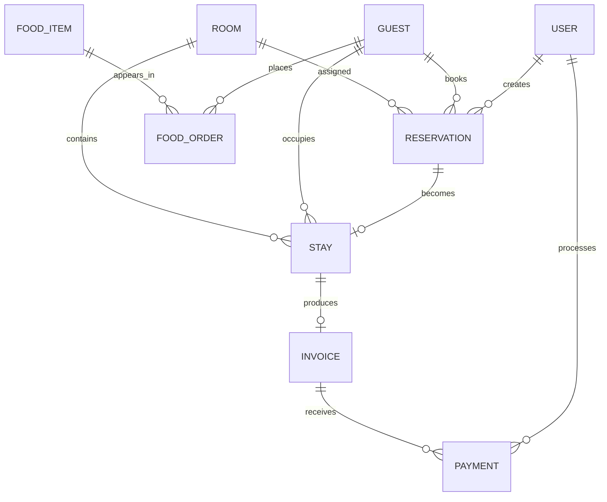

# Database Design

## Collections

`users`, `rooms`, `guests`, `reservations`, `stays`, `fooditems`, `foodorders`, `invoices`, and `payments` are Mongoose collections.

Reservation dates and status are indexed for overlap checks. User email, room number, guest contact fields, and reservation number are indexed for lookup and uniqueness. Financial totals are calculated in backend controllers and stored as numeric values.

## Run order

1. Start MongoDB and copy `backend/.env.example` to `backend/.env`.
2. Set `MONGODB_URI` and a private `JWT_SECRET`.
3. Run `cd backend && npm install && node seed/seedDatabase.js`.
4. Start the API with `npm run dev` in `backend`.
5. Start the Vite client with `npm run dev` from the repository root.

The React pages for dashboard, rooms, guests, reservations, check-in, check-out, restaurant, payments, and invoices use the `/api` service endpoints. Reservation drafts and other client-only workflows remain local UI concerns; MongoDB is the system of record.